# BOJ HELPER 백준 헬퍼

  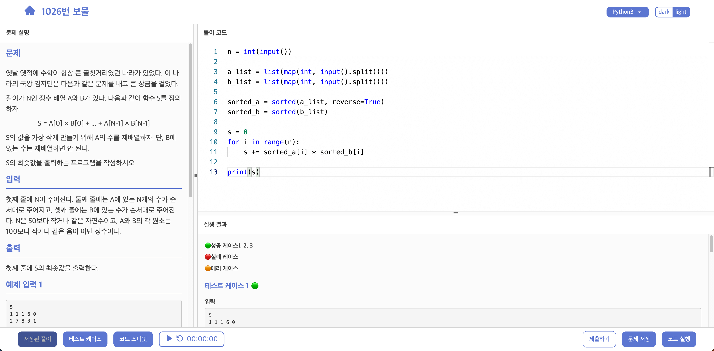

## 홈페이지

[https://boj-helper.vercel.app](https://boj-helper.vercel.app)

## 소개

[백준 사이트](https://www.acmicpc.net/)의 문제 번호를 입력하면 [프로그래머스](https://programmers.co.kr/) 스타일로 문제를 풀 수 있습니다. 
즉, 하나의 창에서 문제를 보며 코드를 작성하고 테스트 케이스도 확인해 볼 수 있습니다. 
또한 여러 부가 기능으로 문제 푸는 데 도움을 받을 수 있습니다.

### 시연 영상

https://www.youtube.com/watch?v=X5pdJCYOxuc

## 기능

### 작성한 코드 테스트
코드를 작성하고 <code>코드 실행</code> 버튼을 클릭하면 각 테스트 케이스에 대하여 <code>성공</code>, <code>실패</code>, <code>에러</code> 상태를 알려줍니다. 

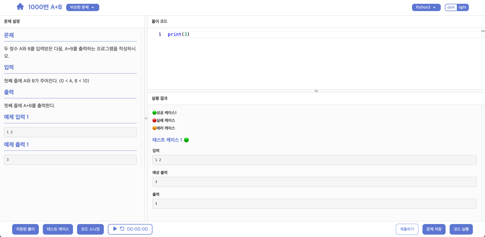

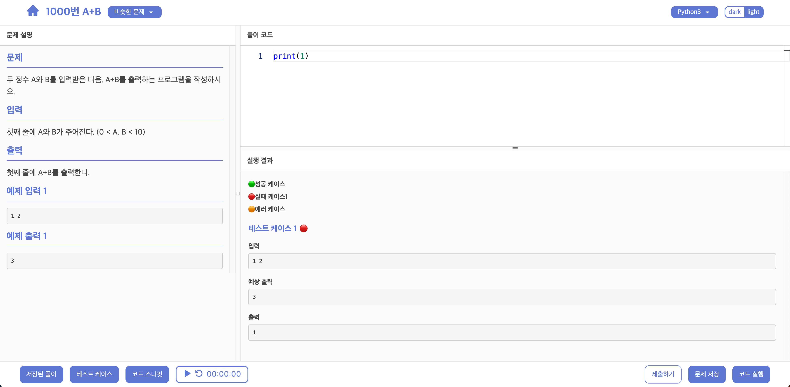

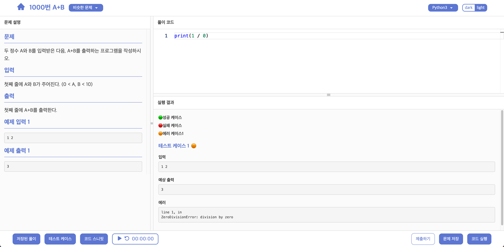

### 테스트 케이스 추가
백준 문제에 나와 있는 입력, 출력 예시는 자동으로 테스트 케이스에 추가됩니다. 
테스트 케이스 추가 버튼을 눌러 직접 테스트 케이스를 추가할 수도 있습니다.

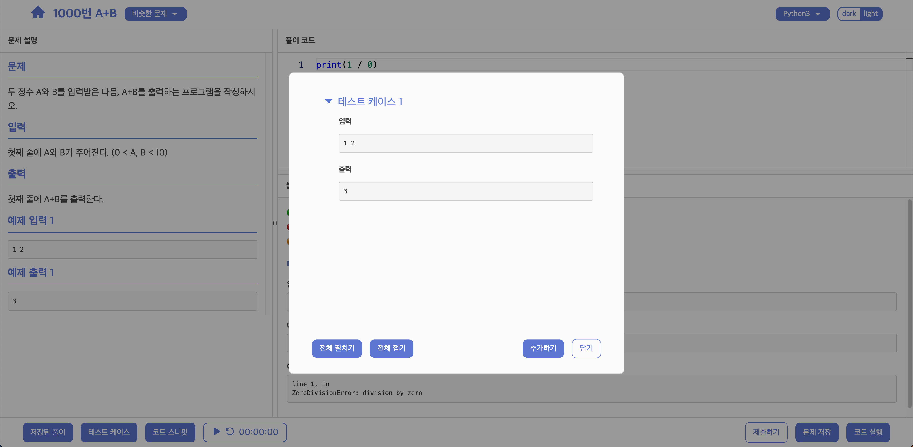

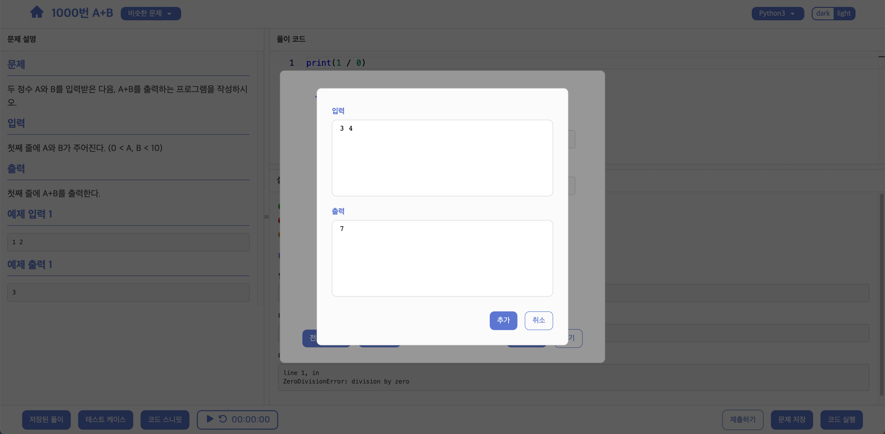

### 문제 저장
나중에 다시 보고 싶은 문제들을 저장할 수 있습니다. 
분류, 난이도를 선택할 수 있으며 다시 풀기를 체크하면 문제 연습 페이지에서 다시 풀어볼 수 있습니다. 
저장한 문제들은 문제 저장소 페이지에서 확인할 수 있습니다. 
문제 저장 시 코드도 같이 저장되며, 다음에 같은 문제를 방문했을 때 전에 저장한 풀이를 볼 수 있습니다. (왼쪽 하단의 <code>저장된 풀이</code> 버튼 클릭)

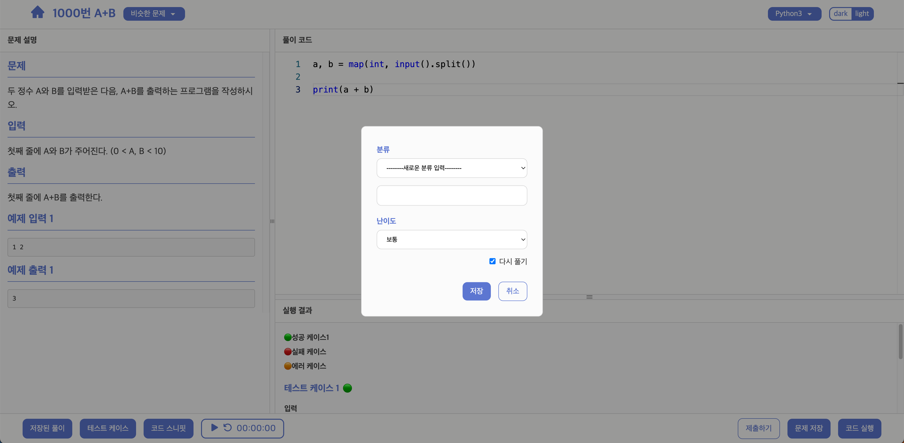

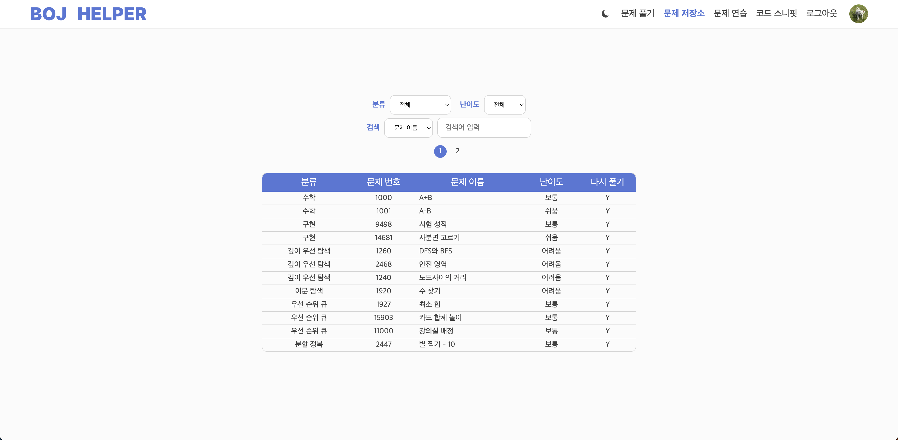

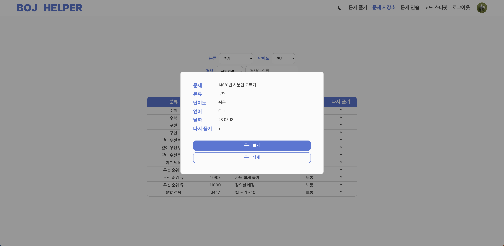

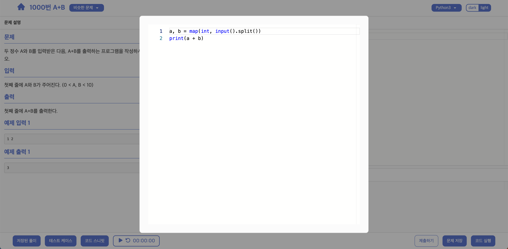

### 코드 스니핏 추가
문제를 풀 때 자주 사용하는 코드 스니핏들을 저장하고 문제를 풀 때 참고할 수 있습니다. (문제를 풀면서 추가도 가능합니다.)

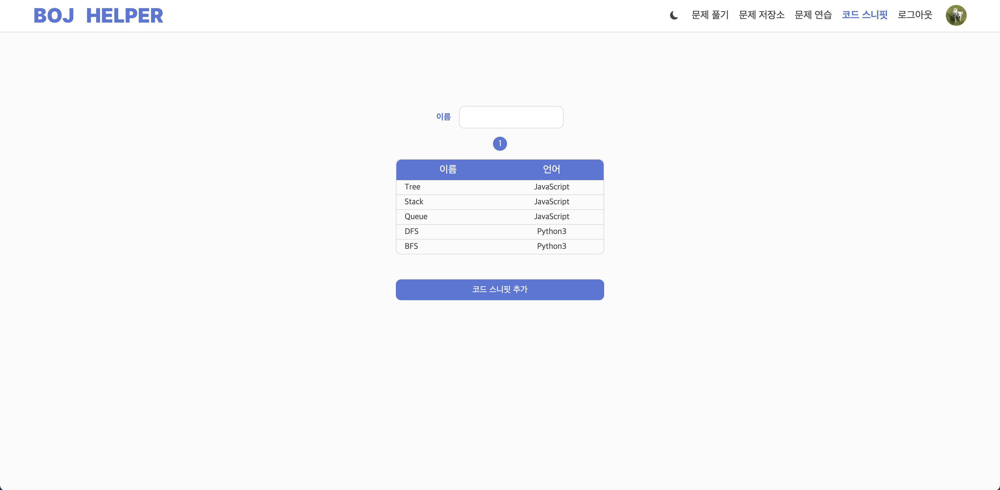

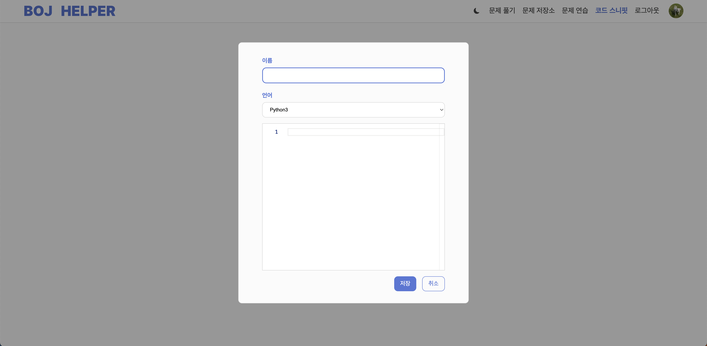

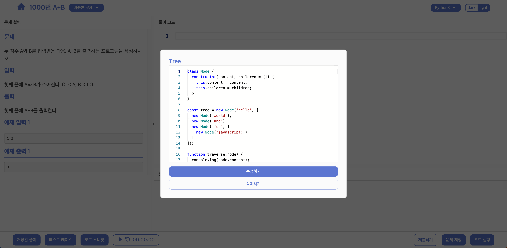

### 문제 다시 풀어보기
저장한 문제들을 다시 풀어볼 수 있습니다. 난이도와 분류를 선택할 수 있으며 해당하는 문제들이 랜덤 순서로 나옵니다. 
오른쪽 상단의 <code>다음 문제</code> 버튼을 클릭하면 다음 문제로 넘어갑니다.

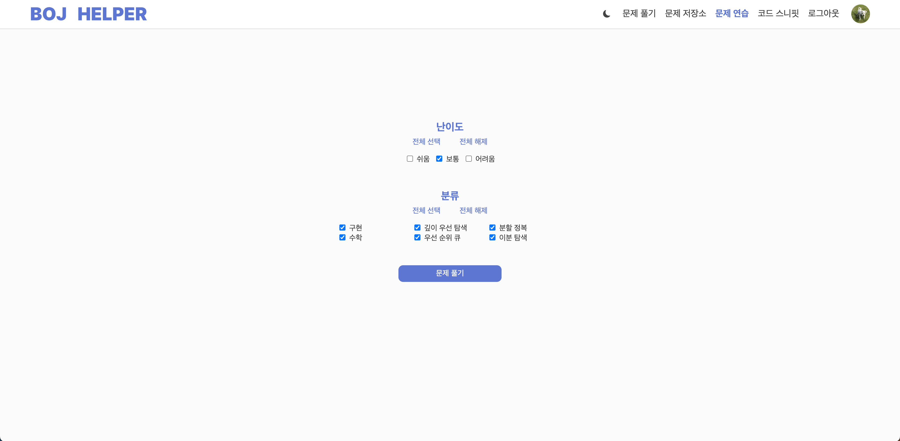

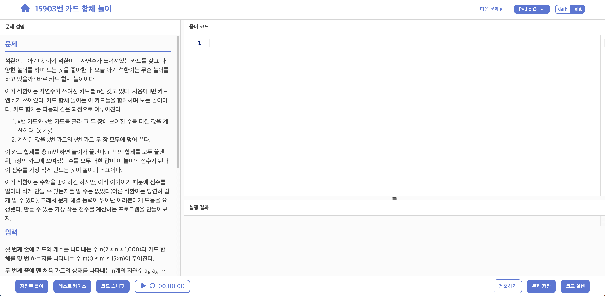

### 스톱워치
문제 푸는 시간을 잴 수 있습니다. 
추후에 정해진 시간이 소요되면 알림을 주는 타이머 기능도 추가하겠습니다.

### 비슷한 문제
왼쪽 상단에 현재 문제와 비슷한 문제들을 보여줍니다. (백준에서 제공하는 경우)

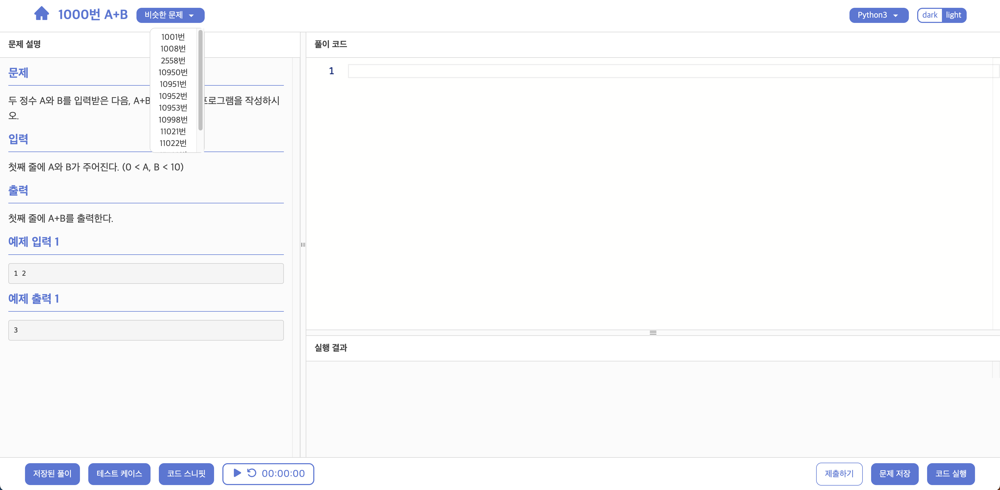

### 반응형 디자인
작은 창 크기나 디바이스에서도 이용할 수 있습니다.

  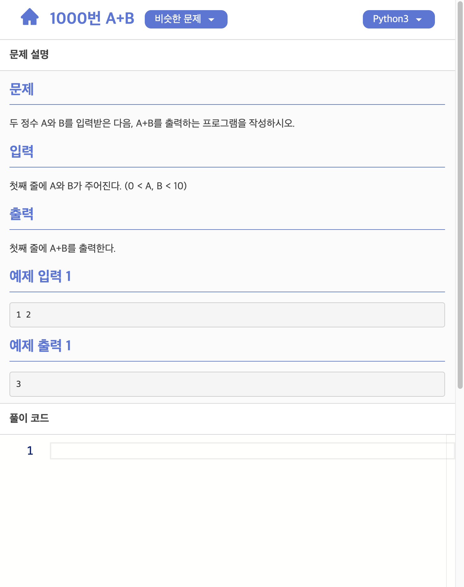
   &nbsp;&nbsp;&nbsp;&nbsp;&nbsp;&nbsp;&nbsp;&nbsp;&nbsp;&nbsp;&nbsp;&nbsp;
  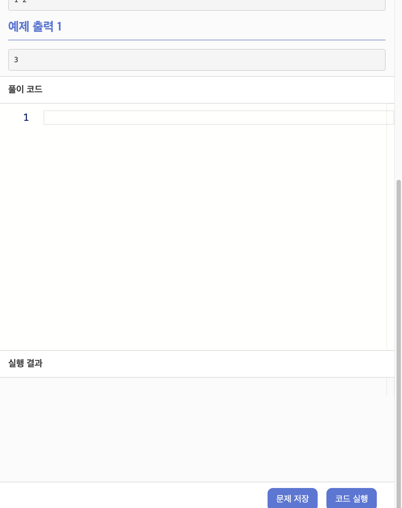

## 지원 언어

### 현재 지원 언어
- Python3
- JavaScript
 
### 추후 예정
현재는 사용자 코드를 돌리기 위한 서버를 따로 두지 않고 사용자의 브라우저에서 코드를 실행하고 있습니다. (파이썬 코드는 [Pyodide](https://github.com/pyodide/pyodide)를 이용합니다.) 
[Judge0](https://github.com/judge0/judge0)를 사용하여 많은 언어를 지원할 수 있지만 자본 문제로 당장은 힘들 것 같습니다. 
사용자가 많이 늘어나면 하루에 일정 시간이라도 서버를 돌려 다른 언어들도 지원해 보도록 하겠습니다. (이미 코드는 작성되어 있습니다.)

## 주의 사항
현재 사용자 코드는 브라우저에서 실행되므로 JavaScript의 stdin을 받아올 때 파일 시스템을 사용할 수 없습니다. 
아래 코드는 복사하여 백준 사이트에 제출하기 편하도록 하기 위한 겉보기 용 코드이며 내부적으로는 테스트케이스의 입력을 stdin에 넣어주는 코드로 대체됩니다. 
따라서 아래 두줄의 코드를 수정하면 입력을 받아올 수 없습니다.

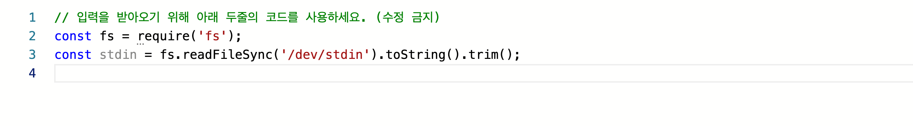

## TODO

- [ ] 타이머 기능
- [ ] 디자인 보강
- [ ] 지원 언어 추가
- [ ] 자동 완성 (현재는 JavaScript만 지원)
- [ ] admin 페이지

## 문의 및 버그 제보

Github issues에 남겨주시면 감사하겠습니다.
